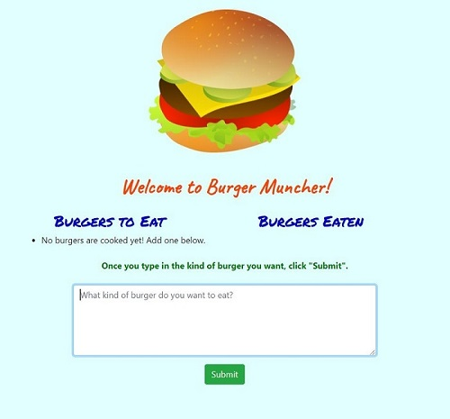

# [Burger Muncher](https://burgers-muncher.herokuapp.com/)

## Description
The goal of this assignment was to become familiar with using the Sequelize CLI in conjunction with Express and Node to communicate with a database in MySQL and render pages using the Handlebars templating tool in the form of a REST API.

Another goal was to explore using the model-view-controller (MVC) file structure in preparation for the next project and to further enhance understanding of the benefits of this organization system. Practicing deployment with Heroku was also necessary.

The Burger Muncher app takes user input in the form of a burger name (e.g. cheeseburger, southwestern, bacon, veggie, etc) and then sorts them into two columns based on if the burger was eaten or not. All burgers start as uneaten, but the user can alter the status by clicking "Eat me," which moves them to the eaten list.

**New class concepts**: Sequelize CLI, MVC file structure, Handlebars, REST APIs

## Challenges
The main issues I encountered were:
1. Rendering the page with the CSS & JS asset files loaded.
2. Getting the PUT request to communicate with the database properly.
3. Using Handlebars to display the data in two columns and then display eaten burgers without leaving them on the uneaten side.
4. Getting seed data to deploy in Heroku based on migrations and seeder files.

## Sources
- [Sequelize Docs](https://sequelize.org/master/index.html)
- [Handlebars: Built-in Helpers](https://handlebarsjs.com/guide/builtin-helpers.html)
- [Sequelize migrations & seed data](https://itnext.io/overcoming-sequelize-hiccups-24e916ebb4c4) & [a similar source](https://dev.niamurrell.com/reference/2019-02-04-sequelize-cli/)